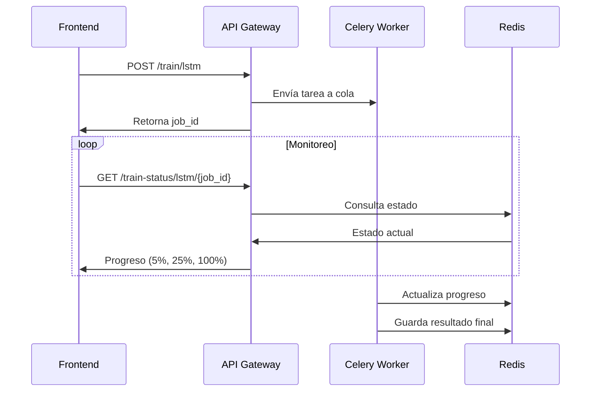

# 📊 StockTimePredictor

[](https://opensource.org/licenses/MIT)
[](https://python.org)
[](https://reactjs.org)
[](https://fastapi.tiangolo.com)
[](https://docker.com)
[](https://redis.io)
[](https://celeryproject.org)

**StockTimePredictor** es una plataforma avanzada de pronóstico bursátil que utiliza procesamiento asíncrono, machine learning distribuido y una interfaz moderna para predecir precios de acciones. Con arquitectura de microservicios, colas de tareas distribuidas y procesamiento GPU, ofrece entrenamiento concurrente de múltiples modelos y monitoreo en tiempo real.

---

## 🧠 Características Principales

### 🔮 Predicción Avanzada
- **Múltiples modelos**: LSTM, Random Forest, XGBoost (Prophet en desarrollo)
- **Procesamiento asíncrono**: Entrenamiento en background con Celery + Redis
- **Colas distribuidas**: Manejo de múltiples trabajos concurrentes por modelo
- **Intervalos de confianza**: Estimación de incertidumbre en predicciones
- **Optimización automática**: Hyperparameter tuning con Keras Tuner y Optuna
- **Soporte GPU**: Aceleración NVIDIA para modelos LSTM

### 🏗️ Arquitectura Moderna
- **Microservicios distribuidos**: API Gateway + servicios especializados por modelo
- **Procesamiento asíncrono**: Celery workers para entrenamiento no bloqueante
- **Redis como broker**: Gestión de colas y almacenamiento de resultados
- **Containerización completa**: Docker Compose con volúmenes persistentes
- **Escalabilidad horizontal**: Fácil adición de workers y servicios

### 💻 Interfaz Avanzada
- **Dashboard reactivo**: Monitoreo en tiempo real con Ant Design
- **Gestión de trabajos**: Seguimiento de múltiples entrenamientos simultáneos
- **Panel de modelos**: Visualización, re-entrenamiento y gestión de modelos guardados
- **Análisis de residuales**: Diagnósticos ACF/PACF para validación de modelos
- **Exportación avanzada**: Descarga de pronósticos y métricas en CSV
- **Temas personalizables**: Modo claro/oscuro con ConfigProvider

### 📊 Análisis Completo
- **Preprocesamiento inteligente**: Pipeline automático de limpieza y transformación
- **Validación robusta**: Cross-validation con métricas detalladas (MAE, RMSE, MAPE, R²)
- **Comparación de modelos**: Benchmarking automático entre algoritmos
- **Visualización interactiva**: Gráficos con zoom, pan y anotaciones
- **Metadatos detallados**: Tracking completo de experimentos y resultados

---

## 🏗️ Arquitectura del Sistema

```bash
StockTimePredictor/
├── 🐳 docker-compose.yml                # Orquestación de servicios
├── 📄 README.md                         # Documentación principal
│
├── 🎨 Frontend/                         # Interfaz de Usuario (React + Ant Design)
│   ├── 📱 public/
│   │   └── index.html                   # Punto de entrada HTML
│   ├── ⚛️ src/
│   │   ├── 🧩 components/               # Componentes React especializados
│   │   │   ├── ConfigurationPanel_AntD.js   # Panel de configuración avanzado
│   │   │   ├── GraphDisplay.js              # Visualización con Chart.js + zoom
│   │   │   ├── MetricsDisplay_AntD.js       # Métricas y resultados detallados
│   │   │   ├── ModelComparisonTable.js     # Comparación entre modelos
│   │   │   ├── ActiveTrainingJobs.js       # Monitor de trabajos concurrentes
│   │   │   ├── ResidualsDisplay.js         # Análisis ACF/PACF de residuales
│   │   │   ├── LoadingSpinner.js           # Indicadores de carga
│   │   │   ├── ErrorMessage.js             # Manejo de errores
│   │   │   └── HelpModal.js                # Sistema de ayuda
│   │   ├── 🎣 hooks/                    # Custom hooks de React
│   │   │   └── useApiMutations.js          # Gestión de mutaciones API con TanStack Query
│   │   ├── 🌐 services/                 # Servicios de comunicación
│   │   │   └── api.js                      # Cliente HTTP con Axios
│   │   ├── 🛠️ utils/                    # Utilidades del frontend
│   │   │   └── pythonUtils.js              # Parsing de metadatos Python
│   │   ├── App.js                      # Componente principal con gestión de estado
│   │   ├── App.css                     # Estilos globales
│   │   └── index.js                    # Punto de entrada React + QueryClient
│   └── 📦 package.json                 # Dependencias y scripts
│
├── 🔧 Backend/                          # Servicios Backend (Python + FastAPI)
│   ├── 🚪 api_gateway/                  # API Gateway (Orquestador Central)
│   │   ├── app.py                      # Router principal con CORS
│   │   ├── Dockerfile                  # Imagen Docker liviana
│   │   └── requirements.txt            # FastAPI, httpx, uvicorn
│   │
│   ├── 🎯 services/                     # Microservicios Especializados
│   │   ├── 🧠 model_lstm/               # Servicio LSTM con GPU
│   │   │   ├── lstm_model.py           # Clase modelo LSTM optimizada
│   │   │   ├── train.py                # Pipeline de entrenamiento con Keras Tuner
│   │   │   ├── forecast.py             # Predicciones con intervalos de confianza
│   │   │   ├── main.py                 # API FastAPI + endpoints
│   │   │   ├── celery_app.py           # Configuración Celery + Redis
│   │   │   ├── tasks.py                # Workers asíncronos para entrenamiento
│   │   │   ├── Dockerfile              # TensorFlow + GPU support
│   │   │   ├── requirements.txt        # TensorFlow, Keras, Celery, Redis
│   │   │   └── models/                 # Modelos persistidos (.h5, .joblib)
│   │   │
│   │   ├── 🌳 model_rf/                 # Servicio Random Forest
│   │   │   ├── rf_model.py             # Implementación Scikit-learn optimizada
│   │   │   ├── train.py                # Pipeline con cross-validation
│   │   │   ├── forecast.py             # Predicciones ensemble con bootstrap
│   │   │   ├── main.py                 # API con endpoints de gestión
│   │   │   ├── celery_app.py           # Workers distribuidos
│   │   │   ├── tasks.py                # Tareas asíncronas de entrenamiento
│   │   │   ├── Dockerfile              # Python slim + dependencias ML
│   │   │   ├── requirements.txt        # Scikit-learn, Joblib, Celery
│   │   │   └── models/                 # Modelos + metadata (.joblib, .json)
│   │   │
│   │   ├── ⚡ model_xgb/                # Servicio XGBoost (En desarrollo)
│   │   │   ├── xgb_model.py            # Modelo XGBoost con Optuna
│   │   │   ├── main_xgb.py             # API del servicio
│   │   │   ├── forecast.py             # Predicciones con boosting
│   │   │   ├── Dockerfile              # Contenedor especializado
│   │   │   └── requirements.txt        # XGBoost, Optuna
│   │   │
│   │   └── 📈 model_prophet/            # Servicio Prophet (Meta) - En desarrollo
│   │       ├── prophet_model.py        # Modelo Facebook Prophet
│   │       ├── prophet_service.py      # Lógica de negocio
│   │       ├── app.py                  # API del servicio
│   │       ├── Dockerfile              # Contenedor con Prophet
│   │       └── requirements.txt        # Prophet, holidays
│   │
│   ├── 🛠️ utils/                        # Utilidades Compartidas
│   │   ├── preprocessing.py            # Pipeline de limpieza y features
│   │   ├── import_data.py              # Descarga optimizada con yfinance
│   │   ├── evaluation.py               # Métricas avanzadas y cross-validation
│   │   ├── visualizations.py           # Generación de gráficos
│   │   └── imports.py                  # Imports centralizados
│   │
│   └── 🎓 training/                     # Scripts de Entrenamiento Batch
│       └── scripts/
│           └── train_rf.py             # Entrenamiento offline masivo
```

---

## ⚙️ Stack Tecnológico

### Backend
- **Framework Web**: FastAPI con Uvicorn
- **Procesamiento Asíncrono**: Celery + Redis
- **Machine Learning**: TensorFlow/Keras, Scikit-learn, XGBoost, Prophet
- **Datos**: yfinance, pandas, numpy
- **Containerización**: Docker + Docker Compose

### Frontend
- **Framework**: React 18.3+ con JavaScript ES6+
- **UI Components**: Ant Design 5.24+
- **Visualización**: Chart.js + React-ChartJS-2
- **Estado**: TanStack React Query
- **HTTP**: Axios

### Infraestructura
- **Message Broker**: Redis 7
- **Containerización**: Docker Compose con volúmenes persistentes
- **GPU Support**: NVIDIA Docker (opcional)

---

## 📈 Modelos de Machine Learning

### Modelos Implementados ✅

- **LSTM**: Redes recurrentes para series temporales complejas con memoria a largo plazo y optimización automática
- **Random Forest**: Ensemble de árboles para robustez general con bootstrapping y reducción de varianza  
- **XGBoost**: Gradient boosting secuencial con regularización L1/L2 y alta precisión

### Modelos en Desarrollo 🔜

- **Prophet**: Modelo de Facebook para estacionalidad automática, tendencias y días festivos
- **Neural Network**: Red densa con dropout, batch normalization y early stopping
- **Ensemble Meta-Model**: Combinación de modelos con voting/stacking y pesos dinámicos

---

## 🚀 Instalación y Configuración

### Prerrequisitos

- **Git** 2.0+: Clonación del repositorio
- **Docker** 20.0+: Containerización  
- **Docker Compose** 2.0+: Orquestación de servicios
- **Node.js** 16.0+: Frontend development (opcional para desarrollo)
- **Python** 3.10+: Backend development (opcional para desarrollo)
- **NVIDIA Docker**: GPU support (opcional)

### 🔧 Instalación Completa

#### 1. Clonar el Repositorio

```powershell
git clone https://github.com/dapuentes/StockTimePredictor.git
cd StockTimePredictor
```

#### 2. Configurar Variables de Entorno (Opcional)

```powershell
# Crear archivo .env para configuración personalizada
echo "RF_SERVICE_URL=http://model-rf-api:8001" > .env
echo "LSTM_SERVICE_URL=http://model-lstm-api:8002" >> .env
echo "CELERY_BROKER_URL=redis://redis_broker:6379/0" >> .env
```

#### 3. Iniciar Backend con Docker

```powershell
# Construir todas las imágenes
docker-compose build

# Iniciar todos los servicios en segundo plano
docker-compose up -d

# Verificar que los servicios estén ejecutándose
docker-compose ps
```

**Servicios Disponibles:**
- 🚪 **API Gateway**: `http://localhost:8000`
- 🔴 **Redis Broker**: `http://localhost:6379` (interno)
- 🧠 **LSTM Service**: `http://localhost:8002` (interno)
- 🌳 **Random Forest API**: `http://localhost:8001` (interno)
- ⚡ **XGBoost**: `http://localhost:8003` (interno)

#### 4. Configurar y Ejecutar Frontend

```powershell
# Navegar al directorio frontend
cd Frontend

# Instalar dependencias
npm install

# Iniciar servidor de desarrollo
npm start
```

**Frontend Disponible**: `http://localhost:3000`

#### 5. Verificar Instalación

```powershell
# Verificar API Gateway
curl http://localhost:8000/

# Verificar salud de servicios
curl http://localhost:8000/health

# Ver logs de servicios
docker-compose logs api-gateway
docker-compose logs model-lstm-api
```

### 🛠️ Desarrollo Local (Sin Docker)

Para desarrollo sin Docker (requiere Redis local):

```powershell
# Instalar y configurar Redis local
# Windows: Descargar Redis desde GitHub releases
# O usar WSL: sudo apt install redis-server

# Backend - Instalar dependencias por servicio
cd Backend/api_gateway
pip install -r requirements.txt

cd ../services/model_lstm
pip install -r requirements.txt

# Iniciar workers Celery manualmente
celery -A model_lstm.celery_app worker -l info

# Frontend
cd ../../../Frontend
npm install
npm start
```

---

## 🧪 Cómo Usar la App

### 🎯 Flujo Básico de Uso

1. **Acceder a la Aplicación**
   - Frontend: `http://localhost:3000`
   - Asegúrate de que todos los servicios Docker estén ejecutándose

2. **Configurar Parámetros de Entrenamiento**
   - **Ticker**: Símbolo de la acción (ej. AAPL, TSLA, MSFT)
   - **Rango de fechas**: Período histórico para entrenamiento
   - **Modelo**: Seleccionar entre RF (Random Forest), LSTM, XGBoost
   - **Parámetros específicos**: 
     - **LSTM**: sequence_length, lags, optimize_params
     - **RF**: n_estimators, max_depth, n_lags
     - **XGBoost**: n_estimators, learning_rate, max_depth

3. **Iniciar Entrenamiento Asíncrono**
   - Clic en **"Entrenar Modelo"**
   - El entrenamiento se ejecuta en **background** usando Celery workers
   - Monitorea el progreso en tiempo real con la barra de progreso
   - Visualiza trabajos activos en el panel **"Active Training Jobs"**

4. **Seguimiento de Trabajos**
   - **Panel de trabajos activos**: Muestra todos los entrenamientos en curso
   - **Estados disponibles**: `PENDING`, `PROGRESS`, `SUCCESS`, `FAILURE`
   - **Información detallada**: Progreso, tiempo transcurrido, mensajes de estado
   - **Cancelación**: Posibilidad de cancelar trabajos en progreso

5. **Revisar Resultados del Entrenamiento**
   - **Métricas de evaluación**: MAE, RMSE, MAPE
   - **Metadatos del modelo**: Tiempo de entrenamiento, parámetros utilizados
   - **Gráficos de entrenamiento**: Curvas de pérdida (para LSTM)
   - **Feature importance**: Importancia de variables (para RF/XGBoost)

6. **Generar Pronósticos**
   - **Horizonte de predicción**: Número de días a futuro (1-30)
   - **Intervalos de confianza**: Bandas de incertidumbre
   - **Visualización interactiva**: Gráfico con zoom, pan y anotaciones
   - **Exportación**: Descarga de resultados en formato CSV

7. **Análisis Avanzado**
   - **Comparación de modelos**: Benchmarking automático entre algoritmos
   - **Análisis de residuales**: Diagnósticos ACF/PACF para validación
   - **Gestión de modelos**: Re-entrenamiento y versionado de modelos

### 🔄 Características del Sistema Asíncrono

- **Entrenamiento concurrente**: Múltiples modelos pueden entrenarse simultáneamente
- **Persistencia de trabajos**: Los trabajos continúan aunque cierres el navegador
- **Notificaciones en tiempo real**: Actualizaciones de progreso sin necesidad de refrescar
- **Gestión de recursos**: Distribución inteligente de carga entre workers
- **Recuperación de errores**: Manejo robusto de fallos y reintentos automáticos

---

## 🌐 API - Comunicación Frontend <-> Backend

### 🔄 Endpoints Principales

- **POST /train/{modelType}**: Iniciar entrenamiento asíncrono (retorna `job_id`)
- **GET /train-status/{modelType}/{job_id}**: Consultar estado del entrenamiento  
- **POST /cancel-training/{modelType}/{job_id}**: Cancelar entrenamiento en progreso
- **GET /predict/{modelType}**: Generar predicciones con modelo entrenado
- **GET /models/{modelType}**: Listar modelos disponibles
- **GET /health**: Estado de salud de todos los servicios

### 🎯 Flujo de Entrenamiento Asíncrono



Implementado en: `frontend/src/services/api.js` y `backend/api_gateway/app.py`

### Características del Sistema Asíncrono

- **Entrenamiento concurrente**: Múltiples modelos pueden entrenarse simultáneamente
- **Monitoreo en tiempo real**: Consulta de progreso con `job_id`
- **Gestión de trabajos**: Cancelación y listado de trabajos activos
- **Manejo de errores**: Respuestas detalladas para fallos y validaciones

---

---

## 🛠️ Desarrollo y Contribución

### Próximas Funcionalidades
- **Modelo Prophet**: Integración completa de Meta Prophet
- **Real-time Data**: Streaming de datos en tiempo real
- **Advanced Analytics**: Análisis de sentimiento y noticias
- **Mobile App**: Aplicación móvil React Native
- **Cloud Deployment**: Deploy en AWS/GCP/Azure

### Mejoras Técnicas
- **Testing Coverage**: Pruebas unitarias y de integración
- **CI/CD Pipeline**: GitHub Actions para deployment
- **Performance Monitoring**: Métricas de rendimiento en producción
- **Database Integration**: PostgreSQL para persistencia

### Configuración para Desarrollo

```bash
# 1. Fork del repositorio en GitHub
# 2. Clonar tu fork
git clone https://github.com/TU_USUARIO/StockTimePredictor.git
cd StockTimePredictor

# 3. Crear rama para feature
git checkout -b feature/nueva-funcionalidad

# 4. Configurar entorno de desarrollo
# Backend
python -m venv venv
venv\Scripts\activate
pip install -r Backend/api_gateway/requirements.txt

# Frontend
cd Frontend
npm install
```

### Pull Request Guidelines

1. **Descripción Clara**: Explica qué cambios introduces
2. **Tests**: Incluye pruebas para nuevas funcionalidades
3. **Documentación**: Actualiza README y docstrings
4. **Screenshots**: Para cambios de UI, incluye capturas

## Monitoreo y Logs

```bash
# Ver logs en tiempo real
docker-compose logs -f api-gateway
docker-compose logs -f model-lstm

---

## 🤝 Contribuciones

¡Las contribuciones son bienvenidas!  
Abre un pull request o issue para sugerencias, mejoras o reportes de errores.

---

## 📄 Licencia

Este proyecto está bajo licencia [MIT](https://opensource.org/licenses/MIT).

---
