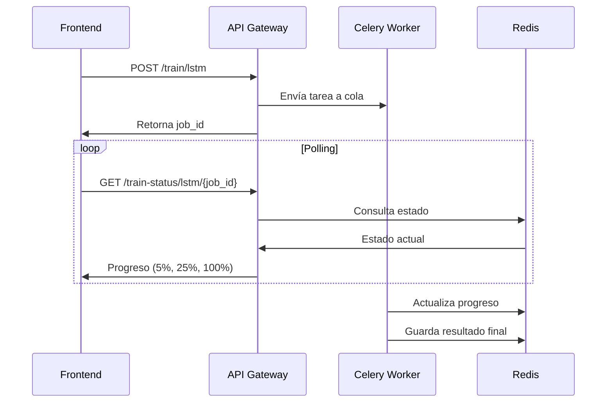

# 📊 StockTimePredictor

[](https://opensource.org/licenses/MIT)
[](https://python.org)
[](https://reactjs.org)
[](https://fastapi.tiangolo.com)
[](https://docker.com)
[](https://redis.io)
[](https://celeryproject.org)

**StockTimePredictor** es una plataforma de pronóstico bursátil que combina procesamiento asíncrono, machine learning distribuido y una interfaz profesional para predecir precios de acciones. Arquitectura de microservicios con colas de tareas distribuidas, soporte GPU y entrenamiento concurrente de múltiples modelos con monitoreo en tiempo real.

---

## 🧠 Características Principales

### Predicción Multi-Modelo
- **4 modelos en producción**: LSTM, Random Forest, XGBoost y Prophet
- **Procesamiento asíncrono**: Entrenamiento en background con Celery + Redis
- **Colas distribuidas**: Trabajos concurrentes por modelo con workers independientes
- **Intervalos de confianza**: Estimación de incertidumbre (Monte Carlo Dropout en LSTM, bootstrap en RF)
- **Optimización automática**: KerasTuner (LSTM), TimeSeriesSplit + RandomizedSearchCV (RF, XGBoost), Cross-validation Prophet
- **Soporte GPU**: Aceleración NVIDIA para entrenamiento LSTM

### Interpretabilidad y Ensemble
- **SHAP Explainer**: Importancia de features, summary plots y waterfall plots para modelos basados en árboles
- **Predictor Ensemble**: Combinación de predicciones con promedio ponderado, mediana, mejor modelo o promedio simple
- **Ponderación por MAE**: El ensemble asigna pesos inversamente proporcionales al error de cada modelo

### Arquitectura
- **Microservicios**: API Gateway + 6 servicios especializados (RF, LSTM, XGBoost, Prophet, SHAP, Ensemble)
- **Procesamiento asíncrono**: Celery workers con Redis como broker (DBs separadas por modelo)
- **Docker Compose**: 13 contenedores orquestados con volúmenes persistentes
- **Escalabilidad horizontal**: Workers y servicios independientes

### Interfaz Profesional
- **Sistema de diseño centralizado**: ~90 CSS variables, paleta financiera, nomenclatura BEM
- **Dashboard reactivo**: Ant Design 5 + Chart.js con zoom/pan interactivo
- **Onboarding contextual**: Welcome card con stepper progresivo para nuevos usuarios
- **Tema claro/oscuro**: Conmutación completa con variables CSS sincronizadas
- **7 tabs de análisis**: Gráfico, Métricas, Detalles del modelo, Comparación, Residuales, SHAP y Predicción Ensemble
- **Gestión de trabajos**: Seguimiento en tiempo real de entrenamientos concurrentes
- **Exportación CSV**: Descarga de pronósticos y métricas

---

## 🏗️ Arquitectura del Sistema

```
StockTimePredictor/
├── docker-compose.yml                   # Orquestación de 13 servicios
├── README.md
│
├── Frontend/                            # React 18 + Ant Design 5
│   ├── public/
│   │   └── index.html
│   ├── src/
│   │   ├── components/                  # Componentes React
│   │   │   ├── ConfigurationPanel_AntD.js   # Panel de configuración
│   │   │   ├── GraphDisplay.js              # Chart.js con zoom/pan/export
│   │   │   ├── MetricsDisplay_AntD.js       # Métricas detalladas
│   │   │   ├── ModelComparisonTable.js      # Benchmarking entre modelos
│   │   │   ├── ModelDetailsDisplay.js       # Hiperparámetros con AntD Descriptions
│   │   │   ├── ActiveTrainingJobs.js        # Monitor de trabajos concurrentes
│   │   │   ├── ResidualsDisplay.js          # Análisis ACF/PACF
│   │   │   ├── ShapExplainer.js             # Interpretabilidad SHAP
│   │   │   ├── EnsemblePredictor.js         # Predicción ensemble multi-modelo
│   │   │   ├── WelcomeCard.js               # Onboarding empty-state
│   │   │   ├── HelpModal.js                 # Sistema de ayuda
│   │   │   ├── dashboard/                   # StatsOverview, QuickActions
│   │   │   └── layout/                      # AppHeader
│   │   ├── context/
│   │   │   └── AppContext.js                # Estado centralizado (useContext)
│   │   ├── hooks/
│   │   │   └── useApiMutations.js           # Mutaciones API con TanStack Query
│   │   ├── services/
│   │   │   └── api.js                       # Cliente HTTP (Axios)
│   │   ├── styles/
│   │   │   └── globals.css                  # Sistema de diseño (~90 variables CSS)
│   │   ├── theme/
│   │   │   └── themeConfig.js               # Tokens Ant Design (light + dark)
│   │   ├── utils/
│   │   │   └── pythonUtils.js               # Parsing de metadatos Python
│   │   ├── App.js                           # Layout principal + routing de tabs
│   │   └── index.js                         # React 18 + QueryClientProvider
│   └── package.json
│
├── Backend/                             # Python + FastAPI
│   ├── api_gateway/                     # Puerto 8000
│   │   ├── app.py                       # Router central con CORS
│   │   ├── Dockerfile
│   │   └── requirements.txt
│   │
│   ├── services/
│   │   ├── model_rf/                    # Puerto 8001
│   │   │   ├── rf_model.py              # RandomForest + Pipeline + SelectFromModel
│   │   │   ├── train.py                 # Pipeline: preprocesamiento → optimización → evaluación
│   │   │   ├── forecast.py              # Predicción recursiva multi-step
│   │   │   ├── main.py                  # API FastAPI
│   │   │   ├── celery_app.py            # Worker Celery (Redis DB 1)
│   │   │   └── tasks.py                 # Tareas asíncronas
│   │   │
│   │   ├── model_lstm/                  # Puerto 8002
│   │   │   ├── lstm_model.py            # LSTM + Monte Carlo Dropout + KerasTuner
│   │   │   ├── train.py                 # Pipeline con preprocesador compartido
│   │   │   ├── forecast.py              # Predicción con intervalos de confianza
│   │   │   ├── main.py                  # API FastAPI
│   │   │   ├── celery_app.py            # Worker Celery (Redis DB 2)
│   │   │   └── tasks.py                 # Tareas asíncronas
│   │   │
│   │   ├── model_xgb/                   # Puerto 8003
│   │   │   ├── xgb_model.py             # XGBRegressor + TimeSeriesSplit
│   │   │   ├── main_xgb.py              # API FastAPI
│   │   │   ├── forecast.py              # Predicción recursiva con features
│   │   │   ├── celery_app.py            # Worker Celery (Redis DB 3)
│   │   │   └── tasks.py                 # Tareas asíncronas
│   │   │
│   │   ├── model_prophet/               # Puerto 8004
│   │   │   ├── prophet_model.py         # Prophet + optimización de hiperparámetros
│   │   │   ├── prophet_service.py       # Lógica de negocio (train, evaluate, predict)
│   │   │   ├── app.py                   # API FastAPI
│   │   │   ├── celery_app.py            # Worker Celery (Redis DB 4)
│   │   │   └── tasks.py                 # Tareas asíncronas
│   │   │
│   │   ├── shap_explainer/              # Puerto 8005
│   │   │   ├── shap_explainer.py        # SHAP values para modelos de árboles
│   │   │   └── app.py                   # API FastAPI
│   │   │
│   │   └── model_ensemble/              # Puerto 8006
│   │       ├── ensemble_model.py        # Ensemble (weighted avg, median, best model)
│   │       └── app.py                   # API FastAPI
│   │
│   ├── utils/                           # Utilidades compartidas
│   │   ├── preprocessing.py             # BasePreprocessor + Factory (RF, LSTM)
│   │   ├── import_data.py               # Descarga con yfinance
│   │   ├── evaluation.py                # evaluate_regression (mse, rmse, mae, mape)
│   │   └── imports.py                   # Imports centralizados
│   │
│   └── training/
│       └── scripts/
│           └── train_rf.py              # Entrenamiento offline
```

---

## ⚙️ Stack Tecnológico

### Backend
| Componente | Tecnología |
|---|---|
| Framework Web | FastAPI + Uvicorn |
| Procesamiento Asíncrono | Celery 5 + Redis 7 |
| ML — Deep Learning | TensorFlow/Keras, KerasTuner |
| ML — Ensemble/Boosting | Scikit-learn, XGBoost |
| ML — Series Temporales | Prophet (Meta) |
| ML — Interpretabilidad | SHAP |
| Datos | yfinance, pandas, NumPy |
| Containerización | Docker + Docker Compose |

### Frontend
| Componente | Tecnología |
|---|---|
| Framework | React 18.3 (Create React App) |
| UI Components | Ant Design 5.24 |
| Visualización | Chart.js 4.4 + react-chartjs-2 + plugins (zoom, annotation) |
| Estado servidor | TanStack React Query 5.75 |
| HTTP | Axios |
| Diseño | Sistema CSS propio (~90 variables, BEM, dark mode) |

### Infraestructura
| Componente | Tecnología |
|---|---|
| Message Broker | Redis 7 (DBs separadas por modelo) |
| Orquestación | Docker Compose (13 contenedores) |
| GPU Support | NVIDIA Docker (opcional, para LSTM) |

---

## 📈 Modelos de Machine Learning

### Random Forest
- Pipeline con `SelectFromModel` para selección de features + `RandomForestRegressor`
- Optimización con `RandomizedSearchCV` + `TimeSeriesSplit`
- Preprocesador compartido (`RandomForestPreprocessor`) con lags e ingeniería de features
- Evaluación con métricas estandarizadas + análisis de residuales ACF/PACF

### LSTM (Long Short-Term Memory)
- Arquitectura: 2 capas LSTM + BatchNormalization + Dropout + Dense
- Optimización de hiperparámetros con KerasTuner (RandomSearch)
- Monte Carlo Dropout para estimación de incertidumbre en predicciones
- Predicción futura recursiva con reconstrucción de precio desde log-returns
- Preprocesador compartido (`LSTMPreprocessor`) con secuencias temporales

### XGBoost
- `XGBRegressor` con optimización vía `RandomizedSearchCV` + `TimeSeriesSplit`
- Ingeniería de features con lags e indicadores técnicos
- Predicción recursiva multi-step con propagación de features
- Escalado de features y target con inverse transform para evaluación

### Prophet
- Modelo Facebook Prophet con regresores externos (Open, High, Low, Volume)
- Optimización de hiperparámetros con cross-validation específica de Prophet
- Soporte para estacionalidad automática y detección de changepoints
- Predicción futura con `make_future_dataframe` e intervalos de confianza nativos

### Ensemble
- Combinación de predicciones de los 4 modelos base
- Métodos: promedio ponderado (por MAE inverso), promedio simple, mediana, mejor modelo
- Cálculo de incertidumbre ensemble (desviación estándar entre modelos)
- Comparación visual de predicciones individuales vs. ensemble

---

## 🚀 Instalación y Configuración

### Prerrequisitos

- **Docker** 20.0+ y **Docker Compose** 2.0+
- **Node.js** 16.0+ (para desarrollo frontend)
- **Python** 3.10+ (para desarrollo backend)
- **NVIDIA Docker** (opcional, para GPU en LSTM)

### Inicio Rápido

```bash
# 1. Clonar el repositorio
git clone https://github.com/dapuentes/StockTimePredictor.git
cd StockTimePredictor

# 2. Construir e iniciar servicios
docker-compose build
docker-compose up -d

# 3. Verificar servicios
docker-compose ps

# 4. Iniciar frontend (desarrollo)
cd Frontend
npm install
npm start
```

**Servicios disponibles:**

| Servicio | URL | Descripción |
|---|---|---|
| Frontend | `http://localhost:3000` | Interfaz de usuario |
| API Gateway | `http://localhost:8000` | Router central |
| Random Forest | `http://localhost:8001` | Servicio RF (interno) |
| LSTM | `http://localhost:8002` | Servicio LSTM (interno) |
| XGBoost | `http://localhost:8003` | Servicio XGBoost (interno) |
| Prophet | `http://localhost:8004` | Servicio Prophet (interno) |
| SHAP | `http://localhost:8005` | Interpretabilidad (interno) |
| Ensemble | `http://localhost:8006` | Combinación de modelos (interno) |
| Redis | `localhost:6379` | Broker de mensajes (interno) |

### Desarrollo Local (Sin Docker)

```bash
# Backend — instalar dependencias por servicio
cd Backend/api_gateway && pip install -r requirements.txt
cd ../services/model_lstm && pip install -r requirements.txt
# ... repetir para cada servicio

# Iniciar workers Celery
celery -A celery_app worker -l info

# Frontend
cd Frontend
npm install
npm start
```

> **Nota**: El comando de frontend es `npm start` (Create React App), no `npm run dev`.

---

## 🧪 Cómo Usar la Aplicación

### Flujo Básico

1. **Seleccionar ticker y modelo** en el panel de Configuración (izquierda)
2. **Entrenar** con el botón "Entrenar Modelo" en la barra de acciones rápidas
3. **Monitorear** el progreso en el panel de Entrenamientos Activos
4. **Generar pronóstico** con el botón "Pronosticar"
5. **Analizar resultados** en las 7 pestañas del panel de Resultados

### Pestañas de Resultados

| Tab | Contenido |
|---|---|
| Gráfico y Pronóstico | Serie temporal histórica + forecast con intervalos de confianza |
| Métricas Detalladas | MSE, RMSE, MAE, MAPE, R² |
| Detalles del Modelo | Hiperparámetros optimizados con tooltips explicativos |
| Comparación de Modelos | Benchmarking automático entre todos los modelos entrenados |
| Residuales | Diagnósticos ACF/PACF para validación estadística |
| Interpretabilidad SHAP | Feature importance, summary plots, waterfall plots |
| Predicción Ensemble | Combinación multi-modelo con comparación visual |

### Sistema Asíncrono

- Entrenamiento concurrente de múltiples modelos en background
- Los trabajos persisten aunque se cierre el navegador
- Actualización de progreso en tiempo real vía polling
- Cancelación y reintento de trabajos desde la interfaz

---

## 🌐 API — Endpoints Principales

| Método | Endpoint | Descripción |
|---|---|---|
| `POST` | `/train/{modelType}` | Iniciar entrenamiento asíncrono → retorna `job_id` |
| `GET` | `/train-status/{modelType}/{job_id}` | Consultar estado del entrenamiento |
| `POST` | `/cancel-training/{modelType}/{job_id}` | Cancelar entrenamiento |
| `GET` | `/predict/{modelType}` | Generar predicciones |
| `GET` | `/models/{modelType}` | Listar modelos disponibles |
| `GET` | `/health` | Estado de salud de todos los servicios |
| `POST` | `/shap/explain` | Obtener explicación SHAP |
| `POST` | `/ensemble/predict` | Predicción ensemble multi-modelo |

### Flujo de Entrenamiento Asíncrono


```mermaid
sequenceDiagram
    participant Frontend
    participant API Gateway
    participant Celery Worker
    participant Redis

    Frontend->>API Gateway: POST /train/lstm
    API Gateway->>Celery Worker: Envía tarea a cola
    API Gateway->>Frontend: Retorna job_id
    
    loop Polling
        Frontend->>API Gateway: GET /train-status/lstm/{job_id}
        API Gateway->>Redis: Consulta estado
        Redis->>API Gateway: Estado actual
        API Gateway->>Frontend: Progreso (5%, 25%, 100%)
    end
    
    Celery Worker->>Redis: Actualiza progreso
    Celery Worker->>Redis: Guarda resultado final
```

---

## 🛠️ Desarrollo y Contribución

### Próximas Funcionalidades
- **Modelo Bayesiano**: BayesianRidge como nuevo modelo base
- **Real-time Data**: Streaming de datos en tiempo real
- **Advanced Analytics**: Análisis de sentimiento y noticias
- **Cloud Deployment**: Deploy en AWS/GCP/Azure

### Mejoras Técnicas Planeadas
- **Testing Coverage**: Pruebas unitarias y de integración
- **CI/CD Pipeline**: GitHub Actions para deployment
- **Database Integration**: PostgreSQL para persistencia de experimentos

### Pull Request Guidelines

1. Descripción clara de los cambios
2. Tests para nuevas funcionalidades
3. Actualizar README y docstrings
4. Screenshots para cambios de UI

---

## Monitoreo y Logs

```bash
# Logs en tiempo real
docker-compose logs -f api-gateway
docker-compose logs -f model-lstm

# Estado de todos los servicios
docker-compose ps

# Reiniciar un servicio específico
docker-compose restart model-rf-api
```

---

## 🤝 Contribuciones

¡Las contribuciones son bienvenidas!
Abre un pull request o issue para sugerencias, mejoras o reportes de errores.

---

## 📄 Licencia

Este proyecto está bajo licencia [MIT](https://opensource.org/licenses/MIT).
